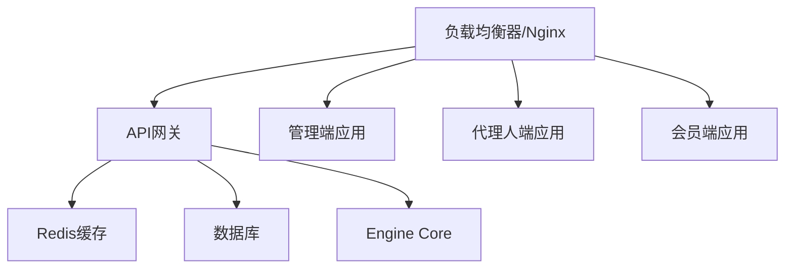

# 生产环境部署方案

## 1. 系统架构

### 1.1 部署架构图


### 1.2 服务组件
- API网关 (api-gateway): Node.js + Express + Redis
- 管理端应用 (admin-console): 静态文件部署
- 代理人端应用 (agent-app): 静态文件部署
- 会员端应用 (member-app): 静态文件部署
- Engine Core (engine-core): NPM包集成
- 数据库: PostgreSQL (建议使用云数据库服务)
- 缓存: Redis (建议使用云Redis服务)

## 2. 部署环境要求

### 2.1 服务器配置
- 操作系统: Linux (推荐Ubuntu 20.04 LTS或CentOS 8)
- CPU: 最低4核
- 内存: 最低8GB
- 磁盘空间: 最低100GB SSD
- 网络带宽: 最低100Mbps

### 2.2 软件依赖
- Node.js 16.x 或更高版本
- Nginx 1.18 或更高版本
- PostgreSQL 13 或更高版本
- Redis 6.0 或更高版本
- Docker (可选，用于容器化部署)
- PM2 (用于Node.js进程管理)

## 3. 部署步骤

### 3.1 环境准备
1. 安装Node.js、Nginx、PostgreSQL、Redis
2. 配置防火墙规则，开放必要端口
3. 创建部署用户和目录结构
4. 配置SSL证书(推荐使用Let's Encrypt)

### 3.2 数据库部署
1. 创建数据库和用户
2. 执行数据库迁移脚本
3. 配置数据库连接池
4. 配置备份策略

### 3.3 API网关部署
1. 复制api-gateway目录到服务器
2. 安装依赖: `npm install`
3. 配置环境变量(数据库连接、Redis连接、JWT密钥等)
4. 使用PM2启动服务: `pm2 start src/index.js --name api-gateway`

### 3.4 前端应用部署
1. 为每个前端应用(member-app, agent-app, admin-console)执行构建:
   ```
   npm run build
   ```
2. 将构建产物(dist目录)复制到Nginx静态文件目录
3. 配置Nginx虚拟主机和反向代理规则

### 3.5 Engine Core部署
1. 发布到NPM私有仓库或复制到各应用的node_modules目录
2. 在API网关中引用Engine Core模块

## 4. 配置管理

### 4.1 环境变量
- DATABASE_URL: 数据库连接字符串
- REDIS_URL: Redis连接字符串
- JWT_SECRET: JWT签名密钥
- API_PORT: API服务端口
- NODE_ENV: 运行环境(production)

### 4.2 Nginx配置
- 配置静态文件缓存策略
- 配置API反向代理
- 配置HTTPS和HTTP/2
- 配置压缩和安全头

## 5. 监控和日志

### 5.1 监控指标
- API响应时间和服务可用性
- 数据库连接数和查询性能
- Redis内存使用和命中率
- 前端页面加载性能

### 5.2 日志管理
- 集中化日志收集(推荐ELK Stack)
- 日志轮转和归档策略
- 错误日志告警机制

## 6. 安全措施

### 6.1 网络安全
- 使用防火墙限制端口访问
- 配置DDoS防护
- 启用WAF(Web应用防火墙)

### 6.2 应用安全
- 定期更新依赖包修复安全漏洞
- 配置CSP、HSTS等安全头
- 实施严格的输入验证和输出编码
- 启用速率限制防止恶意请求

## 7. 备份和恢复

### 7.1 数据备份
- 数据库每日全量备份
- Redis数据持久化配置
- 配置文件和静态资源备份

### 7.2 灾难恢复
- 制定详细的恢复流程文档
- 定期演练恢复过程
- 多地域部署实现高可用

## 8. 性能优化

### 8.1 前端优化
- 启用Gzip压缩
- 静态资源CDN加速
- 图片优化和懒加载
- 代码分割和按需加载

### 8.2 后端优化
- 数据库查询优化和索引
- Redis缓存热点数据
- API响应压缩
- 连接池优化

## 9. 部署验证

### 9.1 功能测试
- 验证所有API接口正常工作
- 验证前端页面正常加载
- 验证用户权限和数据隔离
- 验证交易流程完整

### 9.2 性能测试
- 压力测试API吞吐量
- 测试页面加载时间
- 验证并发用户支持能力

## 10. 运维文档

### 10.1 日常维护
- 监控系统状态和告警
- 定期清理日志和临时文件
- 检查备份任务执行情况
- 更新安全补丁

### 10.2 故障处理
- 制定常见故障处理流程
- 配置监控告警通知
- 建立应急响应机制